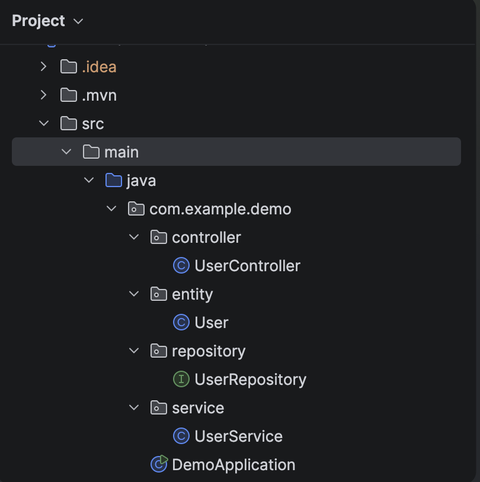
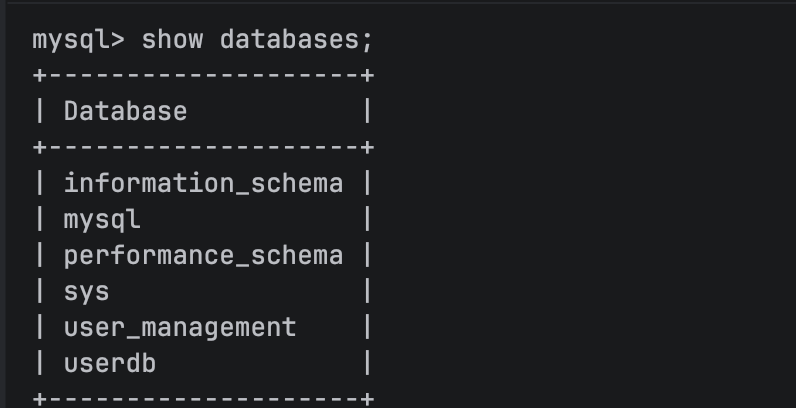
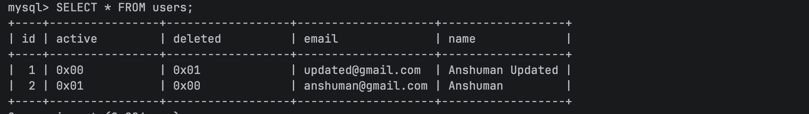
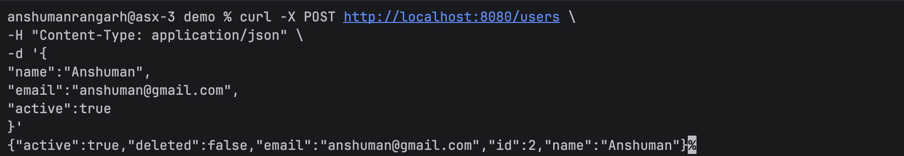
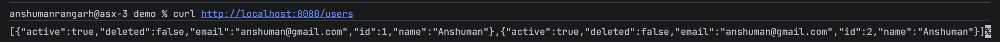
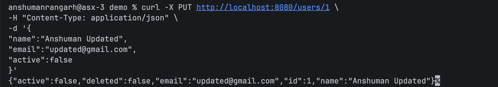
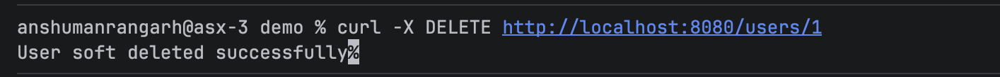
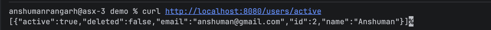
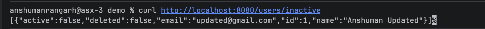

# User Management API


This Task was to  implement complete CRUD operations for User/Customer management, including **Soft Delete** functionality and **Active/Inactive User filtering**.

---

# Features

- Create User
- Read All Users
- Update User
- Soft Delete User
- Active/Inactive User Status
- Fetch Active Users
- Fetch Inactive Users
---

# Technology Stack

| Technology | Version |
|------------|---------|
| Java | 17      |
| Spring Boot | 4.0.6   |
| Maven | 3.9.15  |
| MySQL | 9.6.0   |


---

# Project Structure

```text
src
└── main
    ├── java
    │   └── com.example.demo
    │       ├── controller
    │       │   └── UserController.java
    │       │
    │       ├── service
    │       │   └── UserService.java
    │       │
    │       ├── repository
    │       │   └── UserRepository.java
    │       │
    │       ├── entity
    │       │   └── User.java
    │       │
    │       └── DemoApplication.java
    │
    └── resources
        └── application.properties
```

---

# Database Design

Table Name:

```sql
users
```

Columns:

| Column | Type | Description |
|----------|----------|----------|
| id | BIGINT | Primary Key |
| name | VARCHAR | User Name |
| email | VARCHAR | User Email |
| active | BOOLEAN | Active/Inactive Status |
| deleted | BOOLEAN | Soft Delete Flag |

---

# API Endpoints

## 1. Create User

### Request

```http
POST /users
```

### Request Body

```json
{
  "name": "Anshuman",
  "email": "anshuman@gmail.com",
  "active": true,
  "deleted": false
}
```

### Response

```json
{
  "id": 1,
  "name": "Anshuman",
  "email": "anshuman@gmail.com",
  "active": true,
  "deleted": false
}
```

---

## 2. Get All Users

### Request

```http
GET /users
```

---

## 3. Update User

### Request

```http
PUT /users/{id}
```

### Example

```http
PUT /users/1
```

### Request Body

```json
{
  "name": "Anshuman Updated",
  "email": "updated@gmail.com",
  "active": false
}
```

---

## 4. Soft Delete User

### Request

```http
DELETE /users/{id}
```

### Example

```http
DELETE /users/1
```

### Description

Instead of physically removing the user record from the database, the API updates:

```text
deleted = true
```

This preserves historical data and enables auditing.

---

## 5. Get Active Users

### Request

```http
GET /users/active
```

---

## 6. Get Inactive Users

### Request

```http
GET /users/inactive
```

---

# Soft Delete Implementation

Traditional Delete:

```sql
DELETE FROM users WHERE id = 1;
```

Record is permanently removed.

Soft Delete:

```sql
UPDATE users
SET deleted = true
WHERE id = 1;
```

Record remains in the database but is considered deleted by the application.

---

# MySQL Configuration

File:

```text
src/main/resources/application.properties
```

Configuration:

```properties
spring.datasource.url=jdbc:mysql://localhost:3306/user_management
spring.datasource.username=root
spring.datasource.password=

spring.datasource.driver-class-name=com.mysql.cj.jdbc.Driver

spring.jpa.hibernate.ddl-auto=update
spring.jpa.show-sql=true
spring.jpa.properties.hibernate.format_sql=true
```

---

# Screenshots

## Project Structure




---

## MySQL Database





---

## Create User API




---

## Get All Users API




---

## Update User API


---

## Soft Delete API




---

## Active Users API




---

## Inactive Users API



---

# Getting Started

## Prerequisites

- Java 17
- Maven
- MySQL
- IntelliJ IDEA

---

## Clone Repository

```bash
git clone https://github.com/EfxAnsh/userManagement_api.git
```

---

## Navigate to Project

```bash
cd userManagement_api
```

---

## Build Project

```bash
mvn clean install
```

---

## Run Application

```bash
mvn spring-boot:run
```

Application will start on:

```text
http://localhost:8080
```

---


**Anshuman Rangarh**

GitHub: https://github.com/EfxAnsh


---

